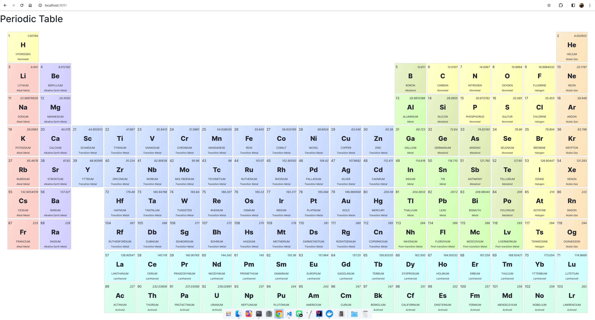

# Periodic Table
A simple app to explore the chemical elements of the periodic table.



## Modules
The module `api` is a simple SpringBoot application that provides REST endpoints for the Periodic Table app to fetch various data like elements, their summary from Wikipedia, images.

While `ui` module is an Angular project to render the webapp.

## To Build
Using Docker is the easiest way to build and run the application.
```sh
docker build -t periodic-table-image .
```
This creates a new docker image `periodic-table-image`. To run it:
```sh
docker run --name periodic-table-app -d -p 9091:9091 periodic-table-image
```
You can access the app at http://localhost:9091.